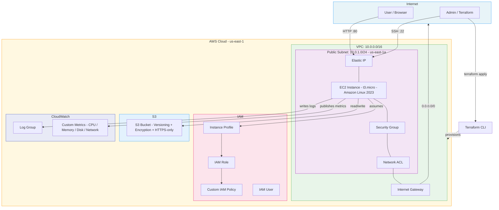
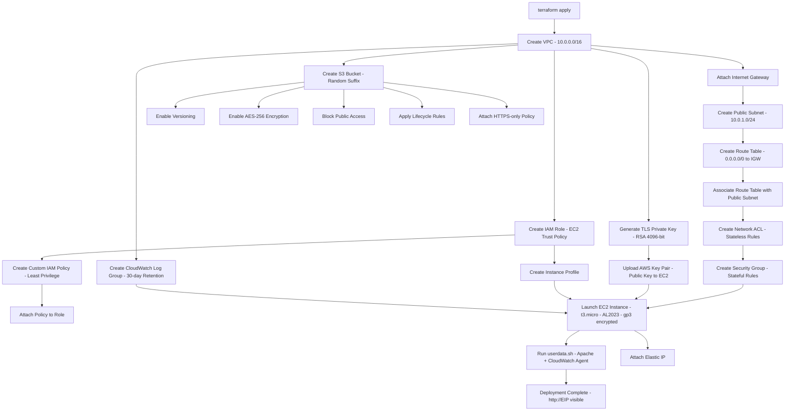
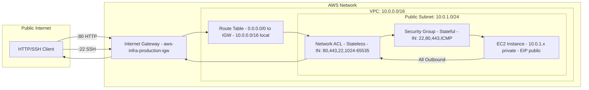
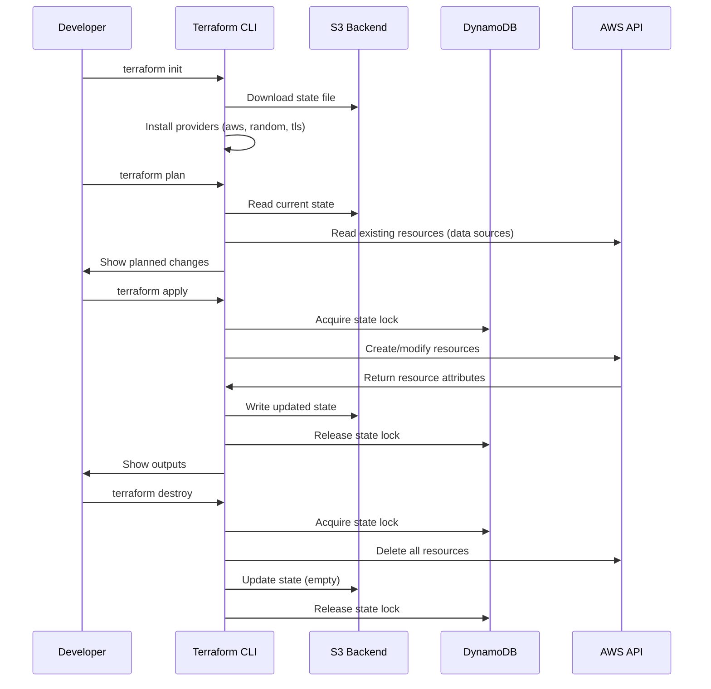
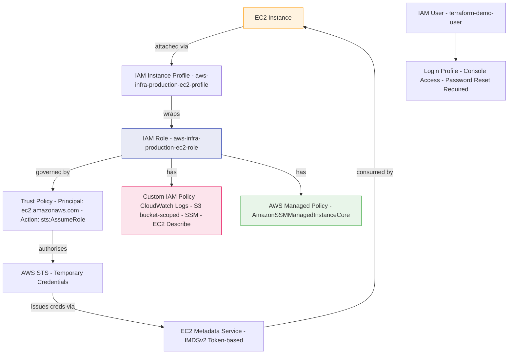
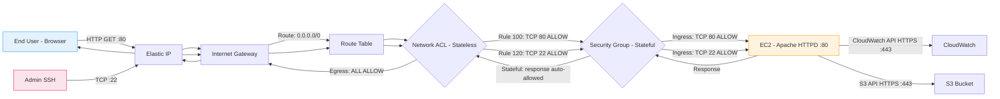

# 🏗️ Production-Grade AWS Infrastructure using Terraform

<div align="center">

[](https://developer.hashicorp.com/terraform)
[](https://aws.amazon.com)
[](LICENSE)
[](https://github.com/anandd/aws-infra-terraform)
[](https://www.hashicorp.com/resources/what-is-infrastructure-as-code)
[](CHANGELOG.md)
[](CONTRIBUTING.md)

**Author: Anand D**

*A complete, production-style AWS infrastructure provisioned entirely through Terraform — built to demonstrate real-world Infrastructure as Code practices for cloud engineering roles.*

</div>

---

## 📋 Table of Contents

- [Project Overview](#-project-overview)
- [Objectives](#-objectives)
- [Features](#-features)
- [AWS Services Used](#-aws-services-used)
- [Terraform Features Used](#-terraform-features-used)
- [Infrastructure Components](#-infrastructure-components)
- [Architecture Overview](#-architecture-overview)
- [Production Design Decisions](#-production-design-decisions)
- [Project Structure](#-project-structure)
- [Infrastructure Workflow](#-infrastructure-workflow)
- [Networking Design](#-networking-design)
- [CIDR Planning](#-cidr-planning)
- [Route Tables](#-route-tables)
- [Security Groups](#-security-groups)
- [IAM Architecture](#-iam-architecture)
- [EC2 Configuration](#-ec2-configuration)
- [S3 Configuration](#-s3-configuration)
- [Remote State](#-remote-state)
- [Variables](#-variables)
- [Outputs](#-outputs)
- [Resource Dependencies](#-resource-dependencies)
- [Terraform Lifecycle](#-terraform-lifecycle)
- [Tags Strategy](#-tags-strategy)
- [Deployment Guide](#-deployment-guide)
- [Installation Guide](#-installation-guide)
- [Validation Guide](#-validation-guide)
- [Testing Guide](#-testing-guide)
- [Screenshots](#-screenshots)
- [Estimated Cost](#-estimated-cost)
- [Troubleshooting](#-troubleshooting)
- [Known Issues](#-known-issues)
- [Future Improvements](#-future-improvements)
- [References](#-references)

---

## 🌐 Project Overview

This repository is a fully self-contained Terraform project that provisions a complete, production-style AWS environment from scratch. Every resource — the network, compute, storage, identity management, logging, and security controls — is defined as code and can be deployed or torn down with a single command.

The project was built as a personal deep-dive into Infrastructure as Code after spending time reading through AWS Well-Architected Framework documentation and noticing a gap between tutorial-level Terraform content (create one EC2 instance in five minutes) and what actually goes into a production deployment. Real production infrastructure involves decisions about CIDR allocation, IAM least privilege, state management, encryption at rest and in transit, log retention, naming conventions, and resource lifecycle — none of which appear in most beginner tutorials.

This project closes that gap. Everything here reflects choices a working cloud engineer would make, and every choice is documented with a *why*, not just a *what*.

The infrastructure can be deployed to any of the ten supported AWS regions listed in the `aws_region` variable validation block. Default values target `us-east-1` since it has the largest selection of instance types and the lowest regional pricing for most services.

---

## 🎯 Objectives

The primary goals of this project are:

1. **Demonstrate production IaC patterns** — not a minimal viable example, but a configuration that would pass a code review at a cloud engineering team.

2. **Document every decision** — each resource block explains why it exists, why specific values were chosen, and what the consequence of a different choice would be.

3. **Apply all major Terraform features** — the project intentionally exercises variables with validation, locals, data sources, lifecycle blocks, `depends_on`, `for_each`, `count`, dynamic blocks, the random and TLS providers, `templatefile()`, remote state, and sensitive outputs.

4. **Implement AWS security best practices** — IMDSv2 enforcement, EBS encryption, S3 public access blocking, HTTPS-only bucket policies, least-privilege IAM, CloudWatch logging — everything the AWS Well-Architected Security Pillar recommends.

5. **Be immediately deployable** — clone the repository, update `backend.tf` with your S3 bucket name, run four commands, and the infrastructure is live. No manual console steps required.

6. **Serve as a reference for cloud engineering interviews** — every resource in this project maps directly to questions that come up in cloud engineer and DevOps interviews.

---

## ✨ Features

- **Single-directory layout** — all Terraform files live in the root directory. No module subdirectories, no complex folder structures. Easy to read, easy to understand.
- **Modular file organisation** — logically separated files (`network.tf`, `security.tf`, `iam.tf`, `ec2.tf`, `s3.tf`) without the overhead of Terraform modules.
- **Automated AMI selection** — always deploys the latest Amazon Linux 2023 AMI via a data source. No hardcoded AMI IDs that go stale.
- **TLS key generation** — generates an RSA-4096 SSH key pair entirely within Terraform. No manual key creation or importing.
- **IMDSv2 enforcement** — blocks the SSRF-based credential theft attack vector present in IMDSv1.
- **End-to-end encryption** — EBS volumes encrypted, S3 encrypted at rest with AES-256, HTTPS-only S3 bucket policy.
- **Automated bootstrapping** — `userdata.sh` installs Apache, the CloudWatch Agent, and renders a live status webpage. The instance is fully configured by the time it finishes booting.
- **S3 lifecycle automation** — objects transition to cheaper storage tiers and old versions expire automatically. No manual cleanup required.
- **Comprehensive outputs** — 30+ outputs covering every key resource attribute, including a pre-formatted SSH command and direct webpage URL.
- **Remote state ready** — `backend.tf` is fully configured for S3 + DynamoDB remote state with instructions for bootstrapping the backend.
- **Consistent tagging** — `default_tags` in the provider block ensures every resource carries the full tag set without repetition.
- **Variable validation** — every input variable has a validation block that catches configuration mistakes before `plan` even runs.

---

## ☁️ AWS Services Used

| Service | Component | Purpose |
|---|---|---|
| **VPC** | Virtual Private Cloud | Isolated network boundary for all resources |
| **EC2** | Elastic Compute Cloud | Application server running Apache |
| **S3** | Simple Storage Service | Object storage with versioning and encryption |
| **IAM** | Identity and Access Management | Roles, policies, and user management |
| **CloudWatch** | Log Groups + Agent | Centralised log collection and custom metrics |
| **EBS** | Elastic Block Store | Encrypted root volume for EC2 |
| **EIP** | Elastic IP | Stable public IP for the EC2 instance |
| **Security Groups** | Virtual Firewall | Stateful instance-level traffic control |
| **Network ACLs** | Subnet Firewall | Stateless subnet-level traffic control |
| **Internet Gateway** | IGW | VPC egress/ingress to the public internet |
| **Route Tables** | Routing | Directs traffic between subnets and IGW |
| **Subnets** | Network Segmentation | Public subnet in a single AZ |
| **Key Pairs** | SSH Access | EC2 login via TLS-generated RSA key |
| **STS** | Security Token Service | Temporary credentials via IAM role assumption |

---

## ⚙️ Terraform Features Used

| Feature | Where Used | Why |
|---|---|---|
| `required_version` | `versions.tf` | Ensures reproducible CLI behaviour |
| `required_providers` | `versions.tf` | Pins provider versions for stability |
| `backend "s3"` | `backend.tf` | Shared remote state with locking |
| `variable` + `validation` | `variables.tf` | Type-safe, self-documenting inputs |
| `local` values | `locals.tf` | DRY computed names and tag maps |
| `data` sources | `main.tf` | Dynamic AMI lookup, account/region metadata |
| `resource` blocks | All resource files | Core infrastructure declarations |
| `output` blocks | `outputs.tf` | Post-apply summaries and pipeline integration |
| `depends_on` | `ec2.tf`, `s3.tf` | Explicit ordering where implicit deps are insufficient |
| `lifecycle` blocks | Multiple resources | `create_before_destroy`, `ignore_changes` |
| `templatefile()` | `ec2.tf` | Variable substitution in the user data script |
| `base64encode()` | `ec2.tf` | Required encoding for EC2 user data |
| `jsonencode()` | `iam.tf`, `s3.tf` | Native HCL-to-JSON for IAM/bucket policies |
| `merge()` | `locals.tf` | Combining base and additional tag maps |
| `timestamp()` | `locals.tf` | Recording creation time in tags |
| `random_id` | `main.tf` | Unique suffixes for globally-scoped names |
| `random_password` | `main.tf` | IAM user demo password |
| `tls_private_key` | `ec2.tf` | In-Terraform SSH key generation |
| `sensitive = true` | `outputs.tf` | Mask private key and password in console output |
| `path.module` | `ec2.tf` | Portable path reference for `templatefile()` |

---

## 🧱 Infrastructure Components

### Network Layer
- **1 VPC** (`10.0.0.0/16`) with DNS hostnames and DNS resolution enabled
- **1 Internet Gateway** attached to the VPC
- **1 Public Subnet** (`10.0.1.0/24`) in `us-east-1a` with auto-assign public IP
- **1 Route Table** with `0.0.0.0/0 → IGW` default route, associated with the public subnet
- **1 Network ACL** with stateless rules for HTTP, HTTPS, SSH, and ephemeral ports

### Security Layer
- **1 Security Group** with inbound rules for SSH (22), HTTP (80), HTTPS (443), ICMP; full outbound

### Compute Layer
- **1 EC2 Instance** (t3.micro, Amazon Linux 2023, gp3 20GB encrypted EBS)
- **1 Elastic IP** bound to the instance for a stable public address
- **1 SSH Key Pair** (RSA-4096, TLS-generated)
- **IMDSv2 enforced** via `metadata_options`

### Identity Layer
- **1 IAM Role** (`aws-infra-production-ec2-role`) with EC2 trust policy
- **1 Custom IAM Policy** (CloudWatch, S3, SSM, EC2 Describe — least privilege)
- **1 AWS Managed Policy** (`AmazonSSMManagedInstanceCore`) attached to role
- **1 IAM Instance Profile** wrapping the role for EC2 attachment
- **1 IAM User** (`terraform-demo-user`) with console access and forced password reset

### Storage Layer
- **1 S3 Bucket** (globally unique name with random suffix)
- AES-256 server-side encryption enabled
- Object versioning enabled
- All public access blocked
- `BucketOwnerEnforced` ownership controls
- HTTPS-only bucket policy
- Three lifecycle rules (IA transition, Glacier transition, multipart cleanup)

### Observability Layer
- **1 CloudWatch Log Group** with 30-day retention
- **CloudWatch Agent** installed via user data (collects Apache logs, system logs, CPU/memory/disk/network metrics)
- Custom metric namespace: `CustomMetrics/aws-infra`

---

## 🏛️ Architecture Overview

### Overall Architecture



### Infrastructure Flow



### Networking Diagram



### Terraform Workflow



### IAM Relationship Diagram



### AWS Resource Dependency Graph

```mermaid
graph TD
    RND["random_id.suffix"] --> S3["aws_s3_bucket.main"]
    RND --> KEY["aws_key_pair.main"]
    TLS["tls_private_key.ssh_key"] --> KEY
    AMI["data.aws_ami.amazon_linux_2023"] --> EC2["aws_instance.main"]
    VPC["aws_vpc.main"] --> SUBNET["aws_subnet.public"]
    VPC --> IGW["aws_internet_gateway.main"]
    VPC --> NACL["aws_network_acl.public"]
    VPC --> SG["aws_security_group.ec2"]
    VPC --> RT["aws_route_table.public"]
    IGW --> RT
    SUBNET --> NACL
    SUBNET --> EC2
    RT --> RTA["aws_route_table_association.public"]
    KEY --> EC2
    SG --> EC2
    ROLE["aws_iam_role.ec2_role"] --> PROFILE["aws_iam_instance_profile.ec2_profile"]
    ROLE --> ATTACH["aws_iam_role_policy_attachment.ec2_custom_policy"]
    POLICY["aws_iam_policy.ec2_policy"] --> ATTACH
    S3 --> POLICY
    PROFILE --> EC2
    CW_LOG["aws_cloudwatch_log_group.application"] --> EC2
    EC2 --> EIP["aws_eip.main"]
    IGW --> EIP
    S3 --> S3_BLOCK["aws_s3_bucket_public_access_block.main"]
    S3 --> S3_VER["aws_s3_bucket_versioning.main"]
    S3 --> S3_ENC["aws_s3_bucket_server_side_encryption_configuration.main"]
    S3 --> S3_OWN["aws_s3_bucket_ownership_controls.main"]
    S3_BLOCK --> S3_POLICY["aws_s3_bucket_policy.force_https"]
    S3_VER --> S3_LC["aws_s3_bucket_lifecycle_configuration.main"]
```



### Traffic Flow Diagram



---

## 🧭 Production Design Decisions

Every configuration choice here reflects a real-world engineering decision, not just what makes the demo work. Here is a record of key decisions and the reasoning behind each one.

### Why a custom VPC instead of the default VPC?

Every AWS account ships with a "default VPC" that is pre-configured and ready to use. The problem is that the default VPC is shared across all your experiments, projects, and environments in the same account. There is no isolation, no audit trail of changes, and the CIDR range is fixed at `172.31.0.0/16`. Using the default VPC is like doing all your work on your desktop rather than in project folders.

This project creates a dedicated VPC (`10.0.0.0/16`) for complete network isolation. Every routing decision, CIDR allocation, and security rule is explicitly defined and tracked in version control.

### Why `10.0.0.0/16` for the VPC CIDR?

The `10.0.0.0/8` range (RFC 1918 private addresses) is the conventional choice for AWS VPCs. Within that range, `10.0.0.0/16` is the most common starting point because:

1. It avoids overlapping with `172.16.0.0/12` (another RFC 1918 range that some corporate VPNs use), which matters when setting up VPC peering.
2. A `/16` provides 65,534 usable host addresses — far more than needed today, but headroom is cheap and re-IP'ing a production network is expensive.
3. It is predictable and widely understood. If a network engineer sees `10.0.0.0/16` as the VPC CIDR, they immediately understand the subnetting plan.

### Why a `/24` for the public subnet?

`10.0.1.0/24` gives 254 usable addresses. For a public subnet hosting EC2 instances and load balancers, that is more than sufficient. Subnetting at `/24` boundaries is a convention that makes the addressing plan easy to read — the third octet tells you which subnet you are in, and the fourth octet is the host.

The subnet only covers `us-east-1a`. A real production deployment would add subnets in at least two AZs (`us-east-1a` and `us-east-1b`) to enable Auto Scaling Groups and Application Load Balancers, both of which require multi-AZ coverage. Single-AZ is acceptable for this learning deployment.

### Why both a Security Group and a NACL?

They serve different purposes and operate at different layers:

- **Security Groups** are stateful (track connection state) and operate at the instance level. They are the primary access control mechanism and the one you reach for first.
- **Network ACLs** are stateless (evaluate every packet independently) and operate at the subnet boundary. They provide a second line of defence and can block traffic before it even reaches the instance's security group.

The NACL in this project mirrors the security group rules, but in a real environment the NACL would be used for subnet-wide blanket blocks (e.g., blocking an entire ASN or country IP range) while security groups handle instance-level fine-grained rules.

Because NACLs are stateless, the ephemeral port range (`1024–65535`) must be explicitly allowed inbound — these are the source ports TCP uses for return traffic. This is a common source of confusion when NACLs are introduced.

### Why IMDSv2?

The EC2 Instance Metadata Service (IMDS) is the HTTP endpoint at `169.254.169.254` that instances use to retrieve information about themselves — most importantly, the temporary IAM credentials issued by the role attached to the instance.

IMDSv1 allows any process on the instance to make a simple GET request to the metadata endpoint. This means that if an application running on the instance can be tricked into making an arbitrary HTTP request (Server-Side Request Forgery, or SSRF), an attacker can steal the IAM credentials with a single request.

IMDSv2 requires a session token obtained via a PUT request before any metadata can be retrieved. SSRF attacks are typically GET-only, so they cannot obtain the token. The configuration `http_tokens = "required"` enforces IMDSv2 exclusively — IMDSv1 is completely disabled.

### Why `gp3` instead of `gp2` for EBS?

`gp3` is the third-generation general purpose SSD volume type. Compared to `gp2`:

- `gp3` baseline is 3,000 IOPS and 125 MB/s throughput, regardless of volume size
- `gp2` scales IOPS with size (3 IOPS/GB), so a 20GB volume only gets 60 IOPS on `gp2`
- `gp3` is approximately 20% cheaper per GB than `gp2` in most regions

For a new deployment, there is no reason to use `gp2`. `gp3` is strictly better on cost and performance for volumes under ~5.3TB.

### Why an Elastic IP?

When an EC2 instance stops and starts, AWS releases and reassigns its public IP address. If you have a DNS record pointing at the instance's IP (or have SSH host key verification configured), it breaks on every restart.

An Elastic IP is a static public IPv4 address that you own independently of any instance. It survives instance stops, restarts, and replacements. In a real environment you would point a Route 53 record at the EIP domain name, and all DNS updates happen automatically. For this project, the EIP ensures the webpage URL and SSH command in the outputs remain valid after restarts.

### Why use an IAM Role instead of access keys on the instance?

This is one of the most important security decisions in cloud infrastructure. Access keys (AWS_ACCESS_KEY_ID and AWS_SECRET_ACCESS_KEY) are long-lived credentials that:

- Can be accidentally committed to Git
- Can be read from application memory dumps
- Can be exfiltrated through SSRF attacks
- Require manual rotation

IAM Roles issue temporary credentials via STS that expire after 1–12 hours and rotate automatically. The credentials are delivered via the IMDS endpoint (protected by IMDSv2 in this project) and are scoped to the specific role's policies. If the credentials are somehow exfiltrated, they expire within hours with no manual intervention required.

The attached Instance Profile is the mechanism that links the IAM Role to the EC2 instance. EC2 does not accept roles directly — the Instance Profile is a required wrapper.

### Why is the S3 bucket policy HTTPS-only?

S3 supports both HTTP and HTTPS access. Without the `aws:SecureTransport` condition in the bucket policy, any client that makes an unencrypted HTTP request to a presigned URL or object path will succeed — transmitting data in plaintext across the internet.

The policy added in `s3.tf` denies any request where `aws:SecureTransport` is `false`, ensuring all data in transit is encrypted by TLS. This is particularly important if the bucket will ever hold application credentials, user data, or audit logs.

### Why enable S3 versioning?

Versioning keeps every version of every object, including deleted objects (which become "delete markers" rather than disappearing). The practical value:

- If application code accidentally overwrites a configuration file, the previous version is one API call away
- If a `terraform destroy` is run on a non-production account and the S3 bucket contains data you need, versioning is the difference between recovery and loss
- Many compliance frameworks (SOC 2, ISO 27001) require object versioning for critical data

The lifecycle rules control the cost by expiring old versions after 90 days and keeping at most 3 non-current versions per object.

---

## 📁 Project Structure

```
aws-infra-terraform/
│
├── provider.tf          # AWS, Random, TLS provider configuration
├── versions.tf          # Terraform version constraints and provider pins
├── backend.tf           # Remote state: S3 bucket + DynamoDB lock
│
├── variables.tf         # All input variables with types, defaults, validation
├── terraform.tfvars     # Concrete variable values for this deployment
├── locals.tf            # Computed values, name prefixes, tag maps
│
├── main.tf              # Data sources, random resources
├── network.tf           # VPC, IGW, Subnet, Route Table, NACL
├── security.tf          # Security Groups
├── iam.tf               # IAM Role, Policy, Profile, User
├── ec2.tf               # EC2, Key Pair, EIP, CloudWatch Log Group
├── s3.tf                # S3 Bucket and all its configuration resources
│
├── outputs.tf           # 30+ outputs for all key resource attributes
├── userdata.sh          # EC2 bootstrap script (Apache, CloudWatch Agent)
│
├── .gitignore           # Excludes state files, .terraform/, keys, secrets
├── LICENSE              # MIT License
├── README.md            # This file
├── CHANGELOG.md         # Version history
└── CONTRIBUTING.md      # Contribution guidelines
```

### Why This File Layout?

Separating resources into purpose-specific files (`network.tf`, `iam.tf`, etc.) gives the same organisational benefits as Terraform modules without the boilerplate of module calls, `module` blocks, and duplicated variable definitions. When you need to understand the networking setup, you open `network.tf`. When an IAM policy question comes up, you open `iam.tf`. The codebase is navigable at a glance.

`main.tf` is intentionally kept small — it holds only data sources and resources (like `random_id`) that do not fit cleanly into any other file. In larger projects, `main.tf` that tries to do everything becomes unmanageable.

---

## 🔄 Infrastructure Workflow

The infrastructure follows this creation order (enforced by Terraform's dependency graph):

1. **Random and data resources** — `random_id.suffix`, `data.aws_ami.amazon_linux_2023`, `data.aws_caller_identity.current`, `data.aws_region.current`
2. **VPC** — the root of all network resources
3. **Internet Gateway** — attaches to VPC; enables IGW-dependent resources
4. **Public Subnet** — depends on VPC CIDR
5. **Route Table + Association** — depends on IGW and Subnet
6. **Network ACL** — depends on VPC and Subnet
7. **Security Group** — depends on VPC
8. **TLS Key + AWS Key Pair** — parallel to network; no network dependency
9. **IAM Role + Policy + Profile** — parallel to network; no network dependency
10. **S3 Bucket + configuration resources** — parallel to network
11. **CloudWatch Log Group** — parallel; needed before EC2 launches
12. **EC2 Instance** — depends on Subnet, SG, Key Pair, Instance Profile, Log Group
13. **Elastic IP** — depends on EC2 instance and IGW

Terraform resolves this graph automatically. `depends_on` is only specified where Terraform cannot infer the dependency from a resource reference — for example, the EC2 instance's user data script references the log group and S3 bucket by name (as template variables), not as Terraform resource references, so an explicit `depends_on` is required.

---

## 🌐 Networking Design

### Design Philosophy

The networking layer uses a minimal but extensible design. The current state is a single public subnet in one AZ. The design is documented with future expansion in mind:

- Reserved space for a private subnet (`10.0.2.0/24`) for database or backend tier
- Reserved space for a second AZ (`10.0.11.0/24`, `10.0.12.0/24`) for high availability
- VPC CIDR `/16` deliberately oversized to accommodate future growth

### CIDR Planning

| Resource | CIDR | Usable Hosts | Purpose |
|---|---|---|---|
| VPC | `10.0.0.0/16` | 65,534 | Network boundary for all resources |
| Public Subnet (AZ-a) | `10.0.1.0/24` | 254 | EC2, EIP, public-facing resources |
| *Private Subnet (AZ-a)* | `10.0.2.0/24` | 254 | *Reserved — future backend tier* |
| *Public Subnet (AZ-b)* | `10.0.11.0/24` | 254 | *Reserved — future multi-AZ* |
| *Private Subnet (AZ-b)* | `10.0.12.0/24` | 254 | *Reserved — future multi-AZ* |

*Italicised rows are reserved for future use — not provisioned by this project.*

### Route Tables

| Route Table | Destination | Target | Purpose |
|---|---|---|---|
| Public RT | `10.0.0.0/16` | local | All intra-VPC traffic stays internal |
| Public RT | `0.0.0.0/0` | Internet Gateway | All other traffic exits to internet |

---

## 🔒 Security Groups

### EC2 Security Group Rules

**Inbound:**

| Rule | Protocol | Port | Source | Purpose |
|---|---|---|---|---|
| 1 | TCP | 22 | `var.allowed_ssh_cidr` (default: `0.0.0.0/0`) | SSH admin access |
| 2 | TCP | 80 | `var.allowed_http_cidr` (default: `0.0.0.0/0`) | HTTP — Apache demo page |
| 3 | TCP | 443 | `0.0.0.0/0` | HTTPS |
| 4 | ICMP | -1 | `0.0.0.0/0` | Ping for connectivity verification |

**Outbound:**

| Rule | Protocol | Port | Destination | Purpose |
|---|---|---|---|---|
| 1 | All | All | `0.0.0.0/0` | Package updates, CloudWatch, S3, SSM |

> **Production note:** In a hardened production environment, SSH (port 22) would be removed and replaced by AWS Systems Manager Session Manager. The inbound ICMP rule would also be removed. For this learning project, both are included to make the deployment easier to interact with.

---

## 🔐 IAM Architecture

### Why This IAM Design?

The IAM configuration follows the **principle of least privilege** — every permission granted is the minimum necessary for the EC2 instance to perform its job. The policies were designed by starting from zero and adding only what was demonstrably needed, rather than starting from a permissive policy and trimming.

### IAM Permissions Granted to EC2 Role

| Service | Actions | Resource Scope | Reason |
|---|---|---|---|
| CloudWatch Logs | `CreateLogGroup`, `CreateLogStream`, `PutLogEvents`, `DescribeLog*` | Specific log group ARN | CloudWatch Agent writes logs |
| CloudWatch Metrics | `PutMetricData`, `GetMetricStatistics`, `ListMetrics` | `*` (metrics API requires `*`) | CloudWatch Agent publishes metrics |
| S3 | `GetObject`, `PutObject`, `DeleteObject`, `ListBucket` | Project bucket ARN only | EC2 reads/writes project data |
| SSM Core | `ssm:GetDocument`, `ssm:UpdateInstanceInformation`, etc. | `*` | SSM Agent registration |
| SSM Messages | `ssmmessages:Create*`, `ssmmessages:Open*` | `*` | Session Manager control channel |
| EC2 Messages | `ec2messages:*` | `*` | SSM Agent communication |
| EC2 Describe | `DescribeInstances`, `DescribeTags`, `DescribeVolumes` | `*` (read-only) | Self-discovery scripts |

Additionally, AWS managed policy `AmazonSSMManagedInstanceCore` is attached to provide the full set of SSM permissions required for Session Manager to function correctly — this managed policy is maintained by AWS and kept up-to-date.

---

## 🖥️ EC2 Configuration

### Instance Specifications

| Attribute | Value | Rationale |
|---|---|---|
| AMI | Latest Amazon Linux 2023 | Official, patched, AWS-maintained |
| Instance Type | `t3.micro` | Free-tier eligible; 2 vCPU, 1 GiB RAM |
| EBS Volume | 20 GiB, `gp3`, encrypted | Cost-effective, better IOPS than `gp2` |
| Public IP | Elastic IP (static) | Survives stop/start cycles |
| IAM Profile | EC2 role for CW + S3 + SSM | No access keys required |
| IMDSv2 | Required (`http_tokens = required`) | Blocks SSRF credential theft |
| Detailed Monitoring | Enabled | 1-minute CloudWatch granularity |
| EBS Optimised | Enabled | Dedicated EBS network bandwidth |

### What userdata.sh Does

The bootstrap script executes on first boot and:
1. Updates all system packages via `dnf update -y`
2. Installs Apache HTTPD, curl, wget, jq, htop
3. Downloads and installs the Amazon CloudWatch Agent RPM
4. Writes a comprehensive CloudWatch Agent JSON configuration (log files + metrics)
5. Starts the CloudWatch Agent with the new configuration
6. Retrieves instance metadata (ID, IPs, AZ, type) via IMDSv2
7. Generates a styled HTML status page displaying all instance metadata
8. Enables and starts Apache HTTPD
9. Verifies services are running with `systemctl is-active`
10. Performs a self-test HTTP request to confirm the webpage returns HTTP 200

The entire script output is logged to `/var/log/userdata.log` and shipped to CloudWatch.

---

## 🪣 S3 Configuration

### Bucket Settings Summary

| Setting | Value | Why |
|---|---|---|
| Name | `aws-infra-production-bucket-<hex>` | Random suffix for global uniqueness |
| Versioning | Enabled | Data protection and recovery |
| Encryption | AES-256 (SSE-S3) | Compliance and data protection |
| Public Access Block | All four controls enabled | Prevent accidental public exposure |
| Object Ownership | `BucketOwnerEnforced` | Disable ACLs; simplify access control |
| Force Destroy | `false` | Prevent accidental data loss |

### Lifecycle Rules

| Rule ID | Trigger | Action |
|---|---|---|
| `expire-noncurrent-versions` | Noncurrent version > 30 days | Transition to `STANDARD_IA` |
| `expire-noncurrent-versions` | Noncurrent version > 90 days (keep 3) | Expire (delete) |
| `abort-incomplete-multipart` | Multipart upload > 7 days old | Abort and clean up |
| `transition-to-ia-and-glacier` | Object age > 90 days | Transition to `STANDARD_IA` |
| `transition-to-ia-and-glacier` | Object age > 365 days | Transition to `GLACIER` |

---

## 📦 Remote State

### Why Remote State?

Local Terraform state (`terraform.tfstate`) stored on your laptop has several fatal problems in a team environment:

1. Only one person can safely run `terraform apply` at a time — no locking mechanism
2. If your laptop dies, the state is gone and Terraform loses track of what it created
3. CI/CD pipelines cannot access a file on your laptop
4. Sensitive values in state (IPs, ARNs, outputs) are not protected

Remote state on S3 with DynamoDB locking solves all of these:

| Problem | Solution |
|---|---|
| Concurrent applies | DynamoDB lock prevents two applies running simultaneously |
| State durability | S3 with versioning — state survives any machine failure |
| Pipeline access | Any CI/CD runner with IAM permissions can read/write state |
| Security | S3 SSE and KMS encryption; state bucket is private |

### Bootstrap Commands

Before `terraform init` can use the remote backend, you need to create the bucket and DynamoDB table. The full commands are in `backend.tf` as a comment block. The key steps are:

1. Create an S3 bucket with versioning and AES-256 encryption enabled
2. Block all public access on the bucket
3. Create a DynamoDB table with partition key `LockID` (type `S`) in PAY_PER_REQUEST billing mode
4. Update the `bucket`, `key`, and `dynamodb_table` values in `backend.tf`
5. Run `terraform init` — Terraform will detect the new backend and initialise it

---

## 📥 Variables

### Complete Variable Reference

| Variable | Type | Default | Description |
|---|---|---|---|
| `aws_region` | `string` | `us-east-1` | AWS region for all resources |
| `project_name` | `string` | `aws-infra` | Prefix for resource names and tags |
| `environment` | `string` | `production` | Deployment environment |
| `owner` | `string` | `Anand D` | Resource owner for tagging |
| `vpc_cidr` | `string` | `10.0.0.0/16` | VPC CIDR block |
| `public_subnet_cidr` | `string` | `10.0.1.0/24` | Public subnet CIDR |
| `availability_zone` | `string` | `us-east-1a` | AZ for subnet and EC2 |
| `instance_type` | `string` | `t3.micro` | EC2 instance type |
| `ami_id` | `string` | `""` | AMI ID (empty = use data source) |
| `associate_public_ip` | `bool` | `true` | Auto-assign public IP |
| `root_volume_size` | `number` | `20` | EBS root volume size (GB) |
| `root_volume_type` | `string` | `gp3` | EBS volume type |
| `s3_force_destroy` | `bool` | `false` | Allow destroy with objects present |
| `s3_versioning_enabled` | `bool` | `true` | Enable S3 versioning |
| `iam_user_name` | `string` | `terraform-demo-user` | Demo IAM username |
| `cloudwatch_log_retention_days` | `number` | `30` | Log retention period |
| `allowed_ssh_cidr` | `string` | `0.0.0.0/0` | CIDR allowed to SSH |
| `allowed_http_cidr` | `string` | `0.0.0.0/0` | CIDR allowed to reach HTTP |
| `additional_tags` | `map(string)` | `{}` | Extra tags to merge |

### Variable Validation Rules

Every variable that accepts a constrained set of values has a `validation` block:

- `aws_region` — must be one of 10 supported regions
- `project_name` — lowercase alphanumeric, hyphens, 3–20 characters
- `environment` — must be `dev`, `staging`, or `production`
- `instance_type` — must be from an approved list of cost-reasonable types
- `root_volume_size` — must be between 8 and 100 GB
- `root_volume_type` — must be `gp2`, `gp3`, `io1`, or `io2`
- `cloudwatch_log_retention_days` — must be an AWS-supported value

---

## 📤 Outputs

### Complete Output Reference

| Output | Type | Description |
|---|---|---|
| `aws_account_id` | string | AWS account ID |
| `aws_region` | string | Deployed region |
| `vpc_id` | string | VPC resource ID |
| `vpc_cidr` | string | VPC CIDR block |
| `internet_gateway_id` | string | IGW resource ID |
| `public_subnet_id` | string | Public subnet ID |
| `public_subnet_cidr` | string | Subnet CIDR |
| `public_route_table_id` | string | Route table ID |
| `network_acl_id` | string | NACL ID |
| `security_group_id` | string | EC2 security group ID |
| `security_group_name` | string | SG name |
| `ec2_instance_id` | string | EC2 instance ID |
| `ec2_instance_arn` | string | EC2 ARN |
| `ec2_private_ip` | string | Private IPv4 |
| `ec2_public_ip` | string | Elastic IP address |
| `ec2_public_dns` | string | Public DNS name |
| `ec2_ami_used` | string | AMI ID used at launch |
| `ec2_availability_zone` | string | AZ of the instance |
| `webpage_url` | string | `http://<EIP>` |
| `ssh_command` | string | Pre-formatted SSH command |
| `ssh_private_key_pem` | string (sensitive) | RSA private key PEM |
| `key_pair_name` | string | AWS Key Pair name |
| `s3_bucket_name` | string | S3 bucket name |
| `s3_bucket_arn` | string | S3 bucket ARN |
| `s3_bucket_domain_name` | string | Regional domain |
| `iam_role_name` | string | EC2 IAM role name |
| `iam_role_arn` | string | EC2 IAM role ARN |
| `iam_instance_profile_name` | string | Instance profile name |
| `iam_policy_arn` | string | Custom policy ARN |
| `iam_user_name` | string | Demo IAM user name |
| `iam_user_arn` | string | Demo IAM user ARN |
| `cloudwatch_log_group_name` | string | Log group name |
| `cloudwatch_log_group_arn` | string | Log group ARN |
| `deployment_summary` | map | Combined key details |

---

## 🔗 Resource Dependencies

### Implicit Dependencies (Terraform detects automatically)

Terraform builds the resource graph by scanning attribute references. For example, `aws_instance.main` references `aws_subnet.public.id` — Terraform knows the subnet must exist before the instance.

### Explicit `depends_on` (manually declared)

| Resource | Depends On | Reason |
|---|---|---|
| `aws_instance.main` | `aws_iam_instance_profile.ec2_profile` | User data script needs the profile active before launch |
| `aws_instance.main` | `aws_cloudwatch_log_group.application` | CloudWatch Agent will fail if log group does not exist |
| `aws_eip.main` | `aws_internet_gateway.main` | EIP association requires IGW to be attached first |
| `aws_s3_bucket_lifecycle_configuration.main` | `aws_s3_bucket_versioning.main` | Noncurrent version lifecycle rules require versioning enabled |
| `aws_s3_bucket_policy.force_https` | `aws_s3_bucket_public_access_block.main` | Policy may be rejected if public access block not configured first |

---

## ♻️ Terraform Lifecycle

### Lifecycle Blocks Used

| Resource | Block | Value | Purpose |
|---|---|---|---|
| `aws_security_group.ec2` | `create_before_destroy` | `true` | Zero-downtime SG replacement |
| `aws_iam_role.ec2_role` | `create_before_destroy` | `true` | Avoid profile orphaning during role changes |
| `aws_instance.main` | `ignore_changes` | `[ami]` | Prevent forced replacement on AMI updates |
| `aws_iam_user_login_profile.demo_user` | `ignore_changes` | `[password_length, password_reset_required]` | Ignore user-driven password changes |

### Why `create_before_destroy` on Security Groups?

When Terraform needs to replace a security group (e.g., you change its name), the default behaviour is destroy-then-create. During the window between destroy and create, the EC2 instance has no security group, which either drops its network connection or creates a gap in the firewall. `create_before_destroy = true` reverses this: the new SG is created first, the instance is moved to it, then the old one is destroyed.

### Why `ignore_changes` on `ami` for EC2?

The `data.aws_ami.amazon_linux_2023` data source always returns the latest AMI. If a new Amazon Linux 2023 AMI is published between your initial deploy and your next `terraform plan`, Terraform would want to replace the instance. In production, you do not want AMI updates to trigger unplanned instance replacements — that is a separate change management process. `ignore_changes = [ami]` suppresses this drift detection.

---

## 🏷️ Tags Strategy

Every resource in this deployment carries a consistent set of tags applied via the provider's `default_tags` block:

| Tag Key | Example Value | Purpose |
|---|---|---|
| `Project` | `aws-infra` | Groups all resources belonging to this deployment |
| `Environment` | `production` | Separates dev / staging / production in billing |
| `Owner` | `Anand D` | Accountability — who to contact about this resource |
| `ManagedBy` | `terraform` | Signals: do not edit in console |
| `CreatedOn` | `2024-12-01T10:00:00Z` | Records when Terraform last applied |
| `CostCenter` | `engineering` | From `additional_tags` — for budget allocation |
| `Repository` | `aws-infra-terraform` | Links resource to the codebase |

The `default_tags` block on the AWS provider applies these to every resource automatically. Individual resources add a `Name` tag and, where relevant, additional context tags like `Tier = "public"` on the subnet.

### Why `ManagedBy = "terraform"`?

This tag tells anyone who opens the AWS Console: do not touch this resource manually. If you need to change something, update the Terraform configuration and apply it. Manual changes create "drift" — a mismatch between the console state and the Terraform state — which can cause confusing failures on the next `terraform plan`.

---

## 🚀 Deployment Guide

### Prerequisites

| Requirement | Version | Check |
|---|---|---|
| AWS Account | Active | AWS Console login |
| AWS CLI | v2.x | `aws --version` |
| Terraform | >= 1.5.0 | `terraform version` |
| Git | >= 2.x | `git --version` |
| SSH client | Any | `ssh -V` |

### AWS IAM Permissions for Deployment

The IAM user or role running Terraform needs the following AWS managed policies (or equivalent custom permissions):

- `AmazonVPCFullAccess`
- `AmazonEC2FullAccess`
- `AmazonS3FullAccess`
- `IAMFullAccess`
- `CloudWatchLogsFullAccess`

> In a production CI/CD pipeline, you would scope these down to exactly the resources Terraform creates — but for a learning deployment, these managed policies are a practical starting point.

---

## 🔧 Installation Guide

### Step 1: AWS CLI Configuration

Install the AWS CLI (v2):

```bash
# macOS (Homebrew)
brew install awscli

# Linux
curl "https://awscli.amazonaws.com/awscli-exe-linux-x86_64.zip" -o "awscliv2.zip"
unzip awscliv2.zip
sudo ./aws/install

# Windows (MSI Installer)
# https://awscli.amazonaws.com/AWSCLIV2.msi
```

Configure with your credentials:

```bash
aws configure
# AWS Access Key ID: <your-key-id>
# AWS Secret Access Key: <your-secret-key>
# Default region name: us-east-1
# Default output format: json
```

Verify the configuration:

```bash
aws sts get-caller-identity
# Should return your account ID, user/role ARN, and user ID
```

### Step 2: Terraform Installation

**macOS:**
```bash
brew tap hashicorp/tap
brew install hashicorp/tap/terraform
```

**Linux (via apt):**
```bash
wget -O- https://apt.releases.hashicorp.com/gpg | sudo gpg --dearmor -o /usr/share/keyrings/hashicorp-archive-keyring.gpg
echo "deb [signed-by=/usr/share/keyrings/hashicorp-archive-keyring.gpg] https://apt.releases.hashicorp.com $(lsb_release -cs) main" | sudo tee /etc/apt/sources.list.d/hashicorp.list
sudo apt update && sudo apt install terraform
```

**Windows:**
```powershell
# Winget
winget install HashiCorp.Terraform
```

Verify:
```bash
terraform version
# Terraform v1.5.x or higher
```

### Step 3: Clone and Configure

```bash
git clone https://github.com/anandd/aws-infra-terraform.git
cd aws-infra-terraform
```

Update `backend.tf` with your S3 bucket name and DynamoDB table name (or use local state by commenting out the `backend` block during initial testing):

```bash
# To use local state temporarily (no backend setup required):
# Comment out the entire backend "s3" block in backend.tf
# Local state will be stored as terraform.tfstate in the project directory
```

Optionally update `terraform.tfvars`:
```bash
# Change allowed_ssh_cidr to your IP for better security:
echo "allowed_ssh_cidr = \"$(curl -s ifconfig.me)/32\"" >> terraform.tfvars
```

---

## 📋 Step-by-Step Commands

### `terraform init`

Initialises the working directory, downloads provider plugins, and configures the backend:

```bash
terraform init
```

Expected output:
```
Initializing the backend...
Initializing provider plugins...
- Finding hashicorp/aws versions matching "~> 5.0"...
- Finding hashicorp/random versions matching "~> 3.5"...
- Finding hashicorp/tls versions matching "~> 4.0"...
- Installing hashicorp/aws v5.x.x...
- Installing hashicorp/random v3.x.x...
- Installing hashicorp/tls v4.x.x...
Terraform has been successfully initialized!
```

### `terraform validate`

Validates the configuration for syntax and semantic correctness without connecting to AWS:

```bash
terraform validate
# Expected: Success! The configuration is valid.
```

### `terraform fmt`

Reformats all `.tf` files to the canonical style (2-space indentation, aligned equals signs):

```bash
terraform fmt -recursive
# Outputs the names of any files that were reformatted
```

### `terraform plan`

Generates an execution plan — shows exactly what Terraform will create, modify, or destroy:

```bash
terraform plan -out=tfplan
```

Review the plan carefully. Look for:
- The number of resources to be created (should be approximately 25 on a clean account)
- No unexpected `destroy` or `replace` operations
- Correct naming using your `project_name` and `environment` values

### `terraform apply`

Executes the plan and creates the infrastructure:

```bash
# Apply the saved plan (recommended — guarantees you apply exactly what you reviewed)
terraform apply tfplan

# Or apply interactively (Terraform will ask for confirmation)
terraform apply
```

The apply takes approximately 2–4 minutes. The EC2 instance launches within 30 seconds; the `userdata.sh` script takes another 1–2 minutes to complete.

After apply completes, outputs will be displayed. Note the `webpage_url` — opening it in a browser should show the live status page within 2 minutes of apply completing.

### Retrieve the SSH Private Key

```bash
terraform output -raw ssh_private_key_pem > my-key.pem
chmod 400 my-key.pem
```

SSH to the instance:
```bash
SSH_CMD=$(terraform output -raw ssh_command)
eval $SSH_CMD -i my-key.pem
# Or manually: ssh -i my-key.pem ec2-user@<EIP>
```

### `terraform destroy`

Destroys all resources created by this configuration:

```bash
terraform destroy
```

> ⚠️ This is irreversible. All resources, including the S3 bucket contents (if `s3_force_destroy = true`), will be deleted.

---

## ✅ Validation Guide

After `terraform apply` completes, run these checks:

### 1. Verify Outputs

```bash
terraform output
# All 30+ outputs should display without errors
```

### 2. Verify EC2 Instance

```bash
# Check instance is running
aws ec2 describe-instances \
  --filters "Name=tag:Project,Values=aws-infra" \
  --query "Reservations[].Instances[].{ID:InstanceId,State:State.Name,IP:PublicIpAddress}" \
  --output table
```

### 3. Verify the Webpage

```bash
# Replace with your actual EIP
WEBPAGE_URL=$(terraform output -raw webpage_url)
curl -s -o /dev/null -w "%{http_code}" "$WEBPAGE_URL"
# Expected: 200
```

### 4. Verify S3 Bucket

```bash
BUCKET=$(terraform output -raw s3_bucket_name)
aws s3 ls "s3://$BUCKET"
# Should list (empty bucket) without error

# Check versioning
aws s3api get-bucket-versioning --bucket "$BUCKET"
# Expected: { "Status": "Enabled" }

# Check encryption
aws s3api get-bucket-encryption --bucket "$BUCKET"
# Expected: SSEAlgorithm: AES256
```

### 5. Verify IAM Role

```bash
ROLE=$(terraform output -raw iam_role_name)
aws iam get-role --role-name "$ROLE" --query "Role.{Name:RoleName,ARN:Arn}" --output table
```

### 6. Verify CloudWatch Logs

```bash
LOG_GROUP=$(terraform output -raw cloudwatch_log_group_name)
aws logs describe-log-groups --log-group-name-prefix "$LOG_GROUP"
# Expected: log group with 30-day retention

# Check for log streams (may take 5–10 minutes after launch)
aws logs describe-log-streams --log-group-name "$LOG_GROUP"
```

---

## 🧪 Testing Guide

### Unit Testing (Syntax and Validation)

```bash
# Format check (non-destructive)
terraform fmt -check -recursive

# Configuration validation
terraform validate

# Review planned changes
terraform plan
```

### Integration Testing (Against Live Infrastructure)

After applying, use the AWS CLI to verify resource attributes match expectations:

```bash
# Check Security Group rules
SG_ID=$(terraform output -raw security_group_id)
aws ec2 describe-security-groups --group-ids "$SG_ID" \
  --query "SecurityGroups[].IpPermissions" --output table

# Check VPC configuration
VPC_ID=$(terraform output -raw vpc_id)
aws ec2 describe-vpcs --vpc-ids "$VPC_ID" \
  --query "Vpcs[].{CIDR:CidrBlock,DNS:EnableDnsHostnames}" --output table

# Check EBS encryption
EC2_ID=$(terraform output -raw ec2_instance_id)
aws ec2 describe-volumes \
  --filters "Name=attachment.instance-id,Values=$EC2_ID" \
  --query "Volumes[].{Encrypted:Encrypted,Type:VolumeType,Size:Size}" --output table

# Check IMDSv2 enforcement
aws ec2 describe-instances --instance-ids "$EC2_ID" \
  --query "Reservations[].Instances[].MetadataOptions" --output table
# HttpTokens should be "required"
```

### Drift Detection

After a week of deployment, run `terraform plan` again. The plan should show zero changes if no manual modifications were made. Any detected drift means someone changed something in the console — useful for catching unauthorised changes.

---

## 📸 Screenshots

*After deploying, capture and add screenshots to the `images/` directory.*

| Screenshot | Path | Description |
|---|---|---|
| VPC Dashboard | `images/vpc.png` | VPC, subnets, route tables in AWS Console |
| EC2 Instance | `images/ec2.png` | Running instance with EIP and tags |
| S3 Bucket | `images/s3.png` | Bucket properties (versioning, encryption) |
| Security Group | `images/security-group.png` | Inbound/outbound rules |
| Terraform Output | `images/terraform-output.png` | `terraform apply` output in terminal |
| AWS Console | `images/aws-console.png` | Resource Map view showing relationships |
| CloudWatch Logs | `images/cloudwatch.png` | Log streams in CloudWatch console |
| Webpage | `images/webpage.png` | Live Apache status page in browser |

---

## 💰 Estimated Cost

> Costs are approximate and vary by region. Based on `us-east-1` pricing as of late 2024.

| Resource | Specification | Estimated Monthly Cost |
|---|---|---|
| EC2 Instance | `t3.micro` (730 hrs/month) | ~$8.47 |
| EBS Volume | 20 GB `gp3` | ~$1.60 |
| Elastic IP | 1 EIP (attached, no charge) | $0.00 |
| S3 Storage | < 1 GB | < $0.03 |
| S3 Requests | < 10,000 | < $0.01 |
| CloudWatch Logs | < 1 GB ingested | < $0.50 |
| CloudWatch Metrics | Custom metrics (< 10) | < $0.30 |
| Data Transfer | < 1 GB/month outbound | < $0.09 |
| **Total** | | **~$11.00/month** |

> **Free Tier:** New AWS accounts get 750 hours/month of `t2.micro` or `t3.micro` usage for 12 months. This project fits comfortably within the free tier if you use a new account and stay within 750 hours.

---

## 🔍 Troubleshooting

| Symptom | Likely Cause | Fix |
|---|---|---|
| `terraform init` fails with S3 error | Backend bucket does not exist | Run the bootstrap commands in `backend.tf` comments first |
| `Error: No valid credential sources found` | AWS CLI not configured | Run `aws configure` or export `AWS_PROFILE` |
| `InvalidAMIID.NotFound` | Region mismatch on custom AMI ID | Leave `ami_id = ""` to use the data source |
| `Error creating S3 bucket: BucketAlreadyExists` | Bucket name collision | The random suffix prevents this; try `terraform destroy` then `apply` |
| EC2 instance reachable but webpage not loading | userdata.sh not finished yet | Wait 2–3 minutes after apply; check `/var/log/userdata.log` via SSH |
| SSH: Permission denied (publickey) | Wrong key file or wrong user | Use `ec2-user` (not `ubuntu` or `root`); ensure key is `chmod 400` |
| SSH: Connection refused | Security group or Apache down | Verify SG allows port 22; check `systemctl status sshd` |
| CloudWatch logs not appearing | IAM role issue or agent not started | SSH in, run `systemctl status amazon-cloudwatch-agent` |
| `Error: Error modifying EC2 Instance` on re-apply | Some EC2 attributes require stop/start | Expected behaviour for certain changes; plan will warn you |
| `terraform destroy` fails on S3 bucket | Bucket contains objects | Set `s3_force_destroy = true` in `terraform.tfvars` and re-apply first |
| `InvalidParameterValue: Invalid IAM Instance Profile` | Profile not fully created | `depends_on` should handle this; try `terraform apply` again |

---

## ⚠️ Known Issues

1. **Single AZ** — the current design places all resources in `us-east-1a`. A single AZ means any AZ-level failure (rare but possible) takes down the application. The fix is to add subnets in `us-east-1b` and `us-east-1c` and use an Auto Scaling Group.

2. **SSH open to `0.0.0.0/0`** — the default `allowed_ssh_cidr` exposes port 22 to the entire internet. Always override this with your specific IP (`"x.x.x.x/32"`) for real deployments. Ideally, remove SSH entirely and use SSM Session Manager.

3. **State file contains private key** — the TLS private key is stored in the Terraform state file. The S3 backend should have SSE enabled (configured in `backend.tf`). Retrieving the key requires `terraform output -raw ssh_private_key_pem`, which is gated by IAM access to the state bucket.

4. **No HTTPS on the webpage** — the demo Apache page runs on HTTP only. Adding HTTPS would require an ACM certificate and a load balancer (ALB), which are planned for a future version.

5. **`timestamp()` in tags causes perpetual drift** — the `CreatedOn` tag uses `timestamp()`, which is re-evaluated on every plan. Subsequent `terraform plan` runs will show a tag update on every resource. This is acceptable for a demo but can be addressed by using `terraform_data` with `triggers_replace` in production.

---

## 🔮 Future Improvements

The following enhancements are planned for future versions:

- [ ] **Private subnet + NAT Gateway** — isolate database and backend workloads from direct internet access
- [ ] **Application Load Balancer** — in front of EC2 for health checks and HTTPS termination
- [ ] **AWS Certificate Manager** — free TLS certificates for HTTPS
- [ ] **Auto Scaling Group** — replace the single instance with a min/max/desired group for availability
- [ ] **RDS PostgreSQL** — managed relational database in the private subnet
- [ ] **ElastiCache Redis** — session caching layer
- [ ] **AWS WAF** — web application firewall rules on the ALB
- [ ] **Multi-AZ network** — subnets in at least two AZs for the ALB and ASG
- [ ] **Route 53** — DNS management and health check routing
- [ ] **GitHub Actions CI/CD** — automated plan and apply on pull request / merge
- [ ] **Terratest** — Go-based integration tests that verify deployed resources
- [ ] **tflint + checkov** — static analysis and security scanning in CI
- [ ] **SSM Session Manager only** — remove port 22 and the key pair entirely
- [ ] **KMS CMK for encryption** — customer-managed keys for S3 and EBS encryption

---

## 📚 References

### AWS Documentation

- [AWS VPC Documentation](https://docs.aws.amazon.com/vpc/latest/userguide/)
- [EC2 User Guide](https://docs.aws.amazon.com/ec2/latest/userguide/)
- [IAM User Guide](https://docs.aws.amazon.com/IAM/latest/UserGuide/)
- [S3 User Guide](https://docs.aws.amazon.com/AmazonS3/latest/userguide/)
- [CloudWatch Documentation](https://docs.aws.amazon.com/cloudwatch/)
- [AWS Well-Architected Framework](https://aws.amazon.com/architecture/well-architected/)
- [EC2 Instance Metadata Service v2](https://docs.aws.amazon.com/AWSEC2/latest/UserGuide/configuring-instance-metadata-service.html)
- [Amazon Linux 2023 User Guide](https://docs.aws.amazon.com/linux/al2023/ug/)

### Terraform Documentation

- [Terraform Language Documentation](https://developer.hashicorp.com/terraform/language)
- [AWS Provider Documentation](https://registry.terraform.io/providers/hashicorp/aws/latest/docs)
- [Terraform S3 Backend](https://developer.hashicorp.com/terraform/language/settings/backends/s3)
- [Variable Validation](https://developer.hashicorp.com/terraform/language/values/variables#custom-validation-rules)
- [Lifecycle Meta-Argument](https://developer.hashicorp.com/terraform/language/meta-arguments/lifecycle)
- [Data Sources](https://developer.hashicorp.com/terraform/language/data-sources)
- [templatefile Function](https://developer.hashicorp.com/terraform/language/functions/templatefile)

### Useful Tools

- [tflint](https://github.com/terraform-linters/tflint) — Terraform linter
- [checkov](https://www.checkov.io/) — Infrastructure security scanner
- [terraform-docs](https://terraform-docs.io/) — Auto-generate docs from Terraform files
- [Infracost](https://www.infracost.io/) — Cloud cost estimation in CI/CD
- [Terratest](https://terratest.gruntwork.io/) — Automated infrastructure testing in Go

---

<div align="center">

**Built with ❤️ by Anand D**

*If this project helped you learn Terraform and AWS, consider starring the repository and sharing it with others who are on the same journey.*

[](https://github.com/anandd/aws-infra-terraform)

</div>

---

## 🔐 Security Checklist

Use this checklist before deploying to any real environment.

### Network Security

- [ ] `allowed_ssh_cidr` restricted to your IP (`x.x.x.x/32`), not `0.0.0.0/0`
- [ ] VPC Flow Logs enabled (not included in this project — add `aws_flow_log` resource)
- [ ] NACL rules reviewed and understood (stateless — ephemeral ports explicitly allowed)
- [ ] No direct database ports (3306, 5432) open in any security group
- [ ] IGW only attached to subnets that truly need internet access

### Compute Security

- [ ] IMDSv2 enforced (`http_tokens = "required"`)
- [ ] EBS root volume encrypted (`encrypted = true`)
- [ ] No SSH private keys stored in environment variables or user data
- [ ] Instance profile used instead of hardcoded access keys
- [ ] `userdata.sh` does not echo secrets or credentials
- [ ] SSM Agent installed (via `AmazonSSMManagedInstanceCore` policy)

### Identity and Access Security

- [ ] IAM role uses least-privilege custom policy (not `AdministratorAccess`)
- [ ] S3 write actions scoped to specific bucket ARN, not `Resource = "*"`
- [ ] No IAM access keys created for the EC2 role
- [ ] IAM user login profile requires password reset on first use
- [ ] No IAM inline policies — all policies attached as managed policies

### Storage Security

- [ ] S3 public access block: all four settings `true`
- [ ] S3 server-side encryption enabled (`AES256` or `aws:kms`)
- [ ] S3 bucket policy denies HTTP (requires `aws:SecureTransport`)
- [ ] S3 versioning enabled
- [ ] `BucketOwnerEnforced` ownership controls set (ACLs disabled)
- [ ] S3 lifecycle rules in place to control cost from versioning

### Logging and Monitoring

- [ ] CloudWatch Log Group created with defined retention period
- [ ] CloudWatch Agent collecting application and system logs
- [ ] Apache access logs shipping to CloudWatch
- [ ] Userdata script output captured in `/var/log/userdata.log`

### State Security

- [ ] Terraform state stored on S3 (not locally for team/CI use)
- [ ] State S3 bucket has versioning enabled
- [ ] State S3 bucket has SSE-S3 or SSE-KMS encryption
- [ ] State S3 bucket public access is fully blocked
- [ ] DynamoDB table configured for state locking
- [ ] `.gitignore` includes `*.tfstate`, `.terraform/`, `*.pem`

---

## 🧩 How the Pieces Connect — End-to-End Walkthrough

Walking through the infrastructure from a user's browser request to the HTML response and back helps solidify understanding of how every component plays its role.

### Request Path: Browser → Apache → Browser

**Step 1 — DNS resolution**

The user types the Elastic IP address (or a domain name pointing to it) into their browser. DNS resolves it to the public IP address of the EIP.

**Step 2 — Internet Gateway**

The packet arrives at the AWS network edge for `us-east-1`. The Internet Gateway receives the inbound packet destined for the EIP and forwards it into the VPC's routing fabric.

**Step 3 — Route Table lookup**

The VPC route table evaluates the destination. The packet is destined for `10.0.1.x` (the private IP of the EC2 instance), which matches the VPC's local route (`10.0.0.0/16 → local`). The packet is routed to the public subnet.

**Step 4 — Network ACL evaluation (stateless)**

The NACL evaluates the inbound packet against its rules in ascending rule number order:
- Rule 100: `TCP port 80, source 0.0.0.0/0, action ALLOW` — the HTTP request matches this rule and is allowed through.

**Step 5 — Security Group evaluation (stateful)**

The Security Group checks its inbound rules. The packet matches:
- `TCP port 80 from 0.0.0.0/0` — allowed.

Because Security Groups are stateful, the return traffic (HTTP response from Apache back to the browser) is automatically allowed without any explicit outbound rule — the Security Group tracks the connection.

**Step 6 — EC2 Instance receives the request**

Apache HTTPD is listening on port 80. It receives the HTTP GET request, reads `/var/www/html/index.html`, and builds the HTTP response.

**Step 7 — Response travels back**

The response exits the instance through the Security Group (auto-allowed, stateful), the NACL outbound Rule 100 (all traffic allowed), the route table (local → IGW for return traffic to public internet), and the Internet Gateway back to the user's browser.

**Step 8 — Browser renders the status page**

The browser receives the styled HTML response and renders the instance status page showing the Instance ID, private IP, AZ, region, and environment.

---

### CloudWatch Agent Path: Instance → CloudWatch

In parallel to serving web traffic, the instance continuously ships data to CloudWatch:

**Log shipping:**
The CloudWatch Agent reads `/var/log/httpd/access_log`, `/var/log/httpd/error_log`, `/var/log/messages`, and `/var/log/userdata.log`. Every new line is buffered and sent to CloudWatch Logs via the CloudWatch API (HTTPS, port 443) using the IAM role credentials retrieved from the EC2 metadata service.

**Metric shipping:**
Every 60 seconds, the CloudWatch Agent samples CPU utilisation, memory usage, disk utilisation, and network bytes sent/received. It publishes these as custom metrics under the `CustomMetrics/aws-infra` namespace. These metrics appear in CloudWatch and can be used to create alarms and dashboards.

**IAM credential flow:**
The EC2 metadata service (IMDSv2) issues temporary credentials from the IAM role. The CloudWatch Agent uses these credentials to sign its API requests to CloudWatch. No access keys are stored on disk.

---

### Terraform State Path: Apply → S3 → DynamoDB

When `terraform apply` runs:

1. Terraform acquires the state lock by writing a record to DynamoDB (`LockID = "your-bucket/key"`)
2. Terraform reads the current state from S3
3. Terraform calls AWS APIs to create/modify resources, collecting returned attributes
4. After all changes succeed, Terraform serialises the new state (resource IDs, attributes, outputs) as JSON
5. Terraform writes the new state to S3 (overwriting the previous version, which S3 versioning preserves)
6. Terraform releases the DynamoDB lock

If `terraform apply` is interrupted (Ctrl+C, network failure, etc.), Terraform detects the incomplete state on the next run and attempts to continue, using the partial state file to understand what was already created.

---

## 📖 Glossary

A quick reference for key terms used throughout this documentation.

| Term | Definition |
|---|---|
| **IaC** | Infrastructure as Code — managing infrastructure through machine-readable definition files rather than manual configuration |
| **VPC** | Virtual Private Cloud — an isolated virtual network within AWS |
| **CIDR** | Classless Inter-Domain Routing — notation for IP address ranges (e.g., `10.0.0.0/16`) |
| **IGW** | Internet Gateway — the VPC component that enables internet connectivity |
| **NACL** | Network Access Control List — stateless subnet-level firewall |
| **Security Group** | Stateful instance-level firewall in AWS |
| **IAM** | Identity and Access Management — AWS's system for controlling who can do what |
| **Role** | An IAM identity with policies, assumable by services or users (not tied to a person) |
| **Instance Profile** | The wrapper that lets an EC2 instance assume an IAM role |
| **SSM** | AWS Systems Manager — a suite of management tools including Session Manager (no SSH required) |
| **EBS** | Elastic Block Store — persistent block storage for EC2 |
| **EIP** | Elastic IP — a static public IPv4 address in AWS |
| **IMDSv2** | Instance Metadata Service version 2 — a session-oriented, token-based API for EC2 metadata |
| **SSRF** | Server-Side Request Forgery — an attack that tricks a server into making requests to internal endpoints |
| **SSE** | Server-Side Encryption — encryption performed by the storage service before writing to disk |
| **STS** | Security Token Service — AWS service that issues temporary credentials via role assumption |
| **gp3** | General Purpose SSD (3rd generation) — current default EBS volume type with better baseline performance than gp2 |
| **HCL** | HashiCorp Configuration Language — the language Terraform configurations are written in |
| **State** | Terraform's record of what resources it manages and their current attribute values |
| **Backend** | Where Terraform stores its state file (local, S3, Terraform Cloud, etc.) |
| **Data Source** | A Terraform block that reads information from an existing resource without managing it |
| **Local Value** | A computed value in Terraform that can be referenced by name, eliminating repetition |
| **Lifecycle** | Meta-arguments in Terraform that control resource creation, update, and destruction behaviour |
| **Provider** | A Terraform plugin that understands how to interact with a specific API (e.g., AWS, Azure) |
| **AMI** | Amazon Machine Image — a template containing the OS and software for launching EC2 instances |
| **User Data** | A script that runs on EC2 instance first boot, used for bootstrapping |
| **Ephemeral Ports** | Source ports (1024–65535) used by TCP for return traffic in stateless firewalls |

---

## 🗓️ Project Timeline

This section documents the development progression of the project as a learning record.

### Week 1 — Foundations

Started by reading the AWS VPC documentation end-to-end. The key realisation in week one was that the default VPC, while convenient, is a crutch that prevents you from understanding how VPC networking actually works. Built the first version with just a VPC, subnet, IGW, and route table — and spent an afternoon debugging why instances could not reach the internet (the route table association was missing).

### Week 2 — Security and IAM

Moved on to IAM, which turned out to be the most complex part of the project. The difference between an IAM Role, an Instance Profile, and how EC2 actually gets credentials via IMDS was confusing at first. The key insight was that the Instance Profile is just a container — the role is where the actual permissions live, and EC2 simply cannot accept a role directly.

The IMDSv2 decision came after reading about the 2019 Capital One data breach, where an SSRF vulnerability was used to steal IAM credentials from the metadata service. Enforcing IMDSv2 with `http_tokens = "required"` is the single most impactful EC2 security configuration change you can make.

### Week 3 — S3 and Encryption

S3 turned out to be deceptively complex to configure correctly. The public access block, ownership controls, encryption, versioning, lifecycle rules, and bucket policy are all separate API calls (and separate Terraform resources). Writing out all of them and understanding why each one matters was genuinely educational.

The lifecycle rules in particular required reading the S3 pricing documentation carefully — versioning without lifecycle rules is a common source of unexpected S3 bills.

### Week 4 — User Data and CloudWatch

Writing the `userdata.sh` script was the most satisfying part of the project. Seeing the instance bootstrap itself, install Apache, configure the CloudWatch Agent, and render a live status page on first boot — all without touching the console — made the "infrastructure as code" value proposition concrete in a way that reading documentation does not.

The IMDSv2 token handling in the script (`PUT` request first, then use the token in subsequent `GET` requests) tripped me up initially — the old one-liner `curl http://169.254.169.254/latest/meta-data/...` does not work when IMDSv2 is required.

### Week 5 — Remote State and Polish

Setting up the S3 + DynamoDB backend required bootstrapping resources before Terraform could manage anything — a classic chicken-and-egg problem. The solution (run the `aws` CLI commands manually once, then use Terraform for everything after) is not elegant but it is the accepted practice.

The final polish pass involved adding variable validation blocks, reviewing every IAM permission to ensure it was truly necessary, adding `create_before_destroy` lifecycle blocks to security groups, and writing out all 30+ outputs.

---

## 🤝 Acknowledgements

- The [AWS Well-Architected Framework](https://aws.amazon.com/architecture/well-architected/) — the foundation for every design decision in the security and reliability dimensions of this project
- [HashiCorp Terraform Documentation](https://developer.hashicorp.com/terraform/docs) — the most complete and well-organised infrastructure tool documentation available
- [Anton Babenko's Terraform AWS Modules](https://github.com/terraform-aws-modules) — invaluable reference for understanding idiomatic Terraform patterns
- [Gruntwork's Terraform Up and Running](https://www.terraformupandrunning.com/) — the best book for going from Terraform basics to production patterns

---

*Last updated: December 2024 | Version 1.3.0 | Author: Anand D*
